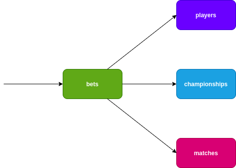

# Bets Application

1 - Github actions - branch main workflow
git checkout -b bugfix/testeworkflow
git add .
git commit -m 'teste workflow'
git push origin bugfix/testeworkflow
aprove pull request branch main 
https://github.com/rrddevops/bets-api/actions/runs/14419663208/job/40440643947

2- Stoplight Spectral Open Source validation contracts json
Exemplo: /home/rodrigo/projetos/bets-api/assets/rules/openapi3.spectral.yaml
  info-contact: error
  operation-tags: error

3 - Postman

4 - ArgoCD

Contains code for Bets Application (demo purpose)

## Big Picture

## Language
**Golang**